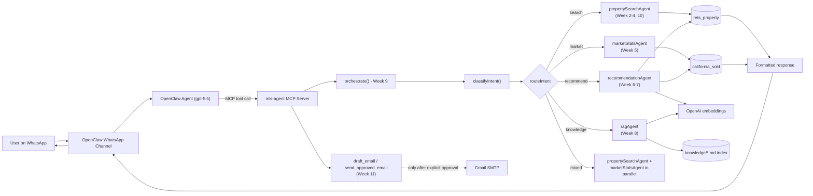

# Week 12 Capstone Demo — Final Project

## Required Features

| Feature | Source Database(s) | Where |
| --- | --- | --- |
| Natural language property search | rets_property | Week 2 ([src/nlp/parsePropertyQuery.ts](../src/nlp/parsePropertyQuery.ts)), Week 3 ([src/tools/searchActiveListings.ts](../src/tools/searchActiveListings.ts)) |
| Conversational multi-turn memory | rets_property | Week 4 ([src/session.ts](../src/session.ts), [src/skills/conversationalPropertySearchSkill.ts](../src/skills/conversationalPropertySearchSkill.ts)) |
| Market analytics & trends | california_sold | Week 5 ([src/tools/getMarketStats.ts](../src/tools/getMarketStats.ts), [python/market_trend.py](../python/market_trend.py)) |
| Comp-validated price assessments | california_sold | Week 7 ([python/recommendations.py](../python/recommendations.py) `validate_with_comps`) |
| Semantic similarity search | rets_property (L_Remarks embeddings) | Week 6 ([python/embeddings.py](../python/embeddings.py)) |
| Recommendation engine | rets_property + california_sold | Week 7 ([python/recommendations.py](../python/recommendations.py)) |
| RAG knowledge assistant | Indexed docs + MLS field definitions | Week 8 ([python/rag.py](../python/rag.py), [knowledge/*.md](../knowledge/)) |
| Multi-agent orchestration | Both tables | Week 9 ([src/skills/orchestrator.ts](../src/skills/orchestrator.ts)) |
| WhatsApp communication layer | Both tables | Week 10 ([src/skills/whatsappHandler.ts](../src/skills/whatsappHandler.ts), `orchestrate_query` MCP tool) |
| Email drafting with approval gate | Both tables | Week 11 ([src/tools/email.ts](../src/tools/email.ts)) |

## Deliverables checklist

- [x] GitHub repository with clean commit history and README - one branch per week, [README.md](../README.md) indexes all of it
- [x] Architecture diagram - below
- [x] Schema annotation - [docs/week3_database_integration.md](week3_database_integration.md) (RETS→RESO mapping table), [knowledge/rets_property_fields.md](../knowledge/rets_property_fields.md), [knowledge/trestle_california_sold_fields.md](../knowledge/trestle_california_sold_fields.md) together cover both tables' field usage
- [ ] 5-minute live demo via WhatsApp + screen share - script below, needs to actually be performed live
- [ ] Demo video recording (backup) - needs to be recorded by screen-capturing a live run
- [ ] Written reflection: what worked, what you would change - this one has to be in your own words; happy to help you brainstorm concrete points to pull from (the bug list across weeks 3-11 is a good source), but the reflection itself should reflect what *you* actually think

## Architecture diagram

## Suggested live demo script (5 minutes, adapted from the handbook's script to this project's actual tool names)

| Segment | ~Time | What to send | What it demonstrates |
| --- | --- | --- | --- |
| Mixed-intent query | 90s | `Use the orchestrate_query tool with userId=<your number> and query: Find me affordable homes in Pasadena and tell me whether prices are rising.` | Week 9 orchestrator routing to two agents in parallel, Week 5 market trend, Week 2-4 search |
| Multi-turn refinement | 60s | Follow up in the same thread with a new constraint (e.g. `only single family homes`) | Week 4 session memory carrying forward city/budget |
| Semantic search + recommendation | 60s | `Use the semantic_property_search tool for "charming home with character and mountain views" in Irvine`, then `Use the recommend_similar_listings tool for listing ID <one returned above>` | Week 6 embeddings, Week 7 hybrid scoring + comp validation |
| RAG knowledge question | 30s | One of the three sample questions (e.g. `Use the rag_answer tool to answer: What is a list-to-close ratio?`) | Week 8 grounded RAG, verifiable via the source-labeled answer |
| Email draft-and-approve | 60s | `Use the draft_weekly_market_report tool for <your email>`, review the draft, then explicitly reply approving it before it's ever sent | Week 11's non-negotiable approval gate |

Save the trajectory-log verification technique (`~/.openclaw/agents/main/sessions/*.trajectory.jsonl`, `tool.call`/`tool.result` entries) for the backup video or write-up, not the live 5 minutes - it's the most reliable way to prove a tool actually ran with real data rather than the LLM improvising, but reading raw JSON isn't demo material.

## Resume outcome

See the CV bullets already drafted for this internship (Week 0-9 scope) - worth revisiting once Weeks 10-11 (and the capstone) are actually demoed, since "WhatsApp communication" and "email workflow automation with human-in-the-loop guardrails" become fully true claims at that point rather than partial ones.
