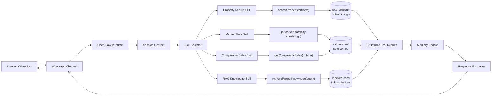

# Week 1 Workflow Diagram

This diagram documents the intended Week 1 architecture flow from WhatsApp through OpenClaw skills and into the local MLS database.

## Plain-English Flow

1. The user sends a request in WhatsApp.
2. The WhatsApp channel passes the message to OpenClaw.
3. OpenClaw loads the user's session context.
4. The skill selector chooses the best skill for the request.
5. The chosen skill calls a typed tool.
6. The tool queries MySQL or indexed documentation.
7. Results are returned as structured data.
8. OpenClaw updates session memory.
9. The response formatter creates a concise WhatsApp message.
10. WhatsApp sends the answer back to the user.

## Current Implementation Status

| Area | Status |
| --- | --- |
| OpenClaw installation | Installed locally |
| OpenAI API key | Pending from project owner |
| WhatsApp linked device | Not fully verified |
| MySQL schema | `idx_exchange` created |
| `rets_property` data | Partial import only; source SQL appears incomplete |
| `california_sold` data | Imported locally, row count needs confirmation against full expected dataset |
| Week 1 docs | This document plus `week1_architecture.md` |
